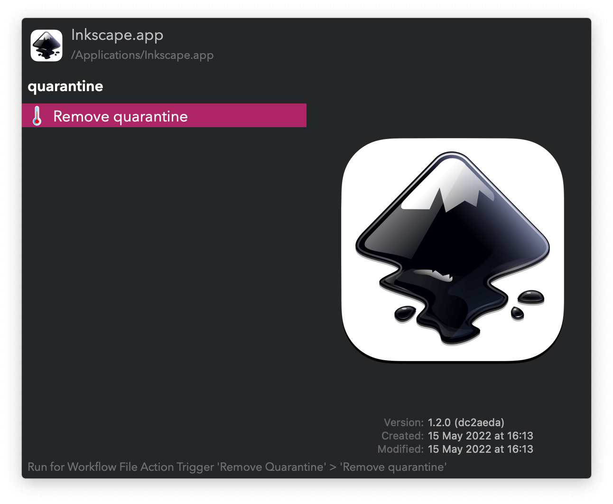

#  Remove Quarantine Alfred Workflow

Delete the quarantine attribute from app bundles and files

<a href='https://alfred.app/workflows/vitor/remove-quarantine'>⤓ Install From the Alfred Gallery</a>

## Usage

Use the [Universal Action](https://www.alfredapp.com/help/features/universal-actions/) to unquarantine any file or folder.

Alternatively, search your quarantined apps in `/Applications` via the Search Apps Keyword (default: `rq`). <kbd>⏎</kbd> to remove the quarantine.
